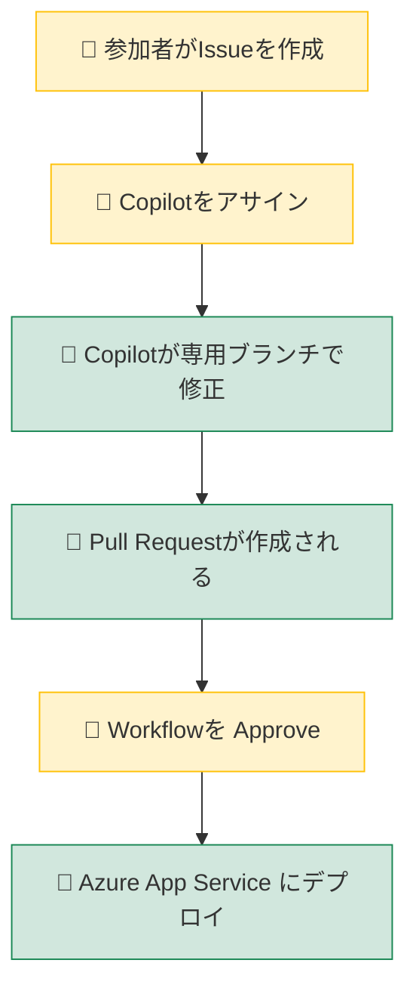
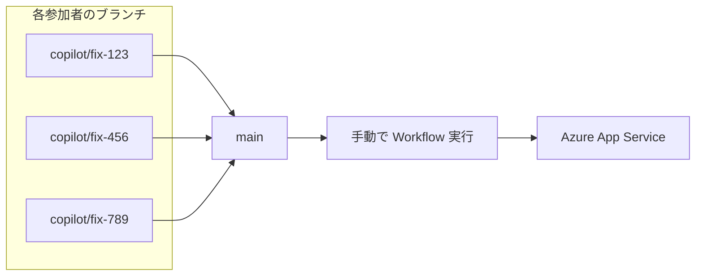

# ワークショップでの並行作業について

複数名で同時に作業する場合の注意事項です。

## 作業フロー



- 👤 **黄色**: 参加者が手動で行う操作
- 🤖 **緑色**: 自動で実行される処理

1. **Issue 作成**: 各参加者が修正内容を Issue として記載
2. **Copilot アサイン**: Issue に Copilot をアサイン
3. **自動修正**: Copilot が専用ブランチを作成し、コードを修正
4. **PR 作成**: 修正完了後、Pull Request が自動作成される
5. **デプロイ**: Workflow を Approve すると Azure App Service にデプロイ

## ⚠️ 並行デプロイ時の注意（後勝ち）

複数の参加者が同時に Workflow を Approve してデプロイすると、**同じ Azure 環境に対して後からデプロイした内容が反映されます**（後勝ち）。

```
参加者A: デプロイ開始 ────────> 完了（反映）
参加者B:     デプロイ開始 ────────> 完了（上書き）← この内容が最終的に反映
```

今回のワークショップでは、シンプル化のためこの動作を許容しています。

> 💡 **本番環境では？**  
> 以下のような方法で並行デプロイの競合を回避できます。
> - **デプロイスロット**: ステージングスロットにデプロイ → 検証後にスワップ
> - **環境の分離**: 開発者ごと・ブランチごとに別の App Service を用意

## 全員の変更をまとめてデプロイする場合

並行して作成された複数のブランチの変更を統合したい場合は、以下の手順で行います。



1. **各 PR を `main` ブランチにマージ**
   - コンフリクトがある場合は解消してからマージ

2. **Workflow を手動実行**
   - GitHub → **Actions** タブ → **Deploy to Azure** を選択
   - **Run workflow** ボタンをクリック
   - ブランチ: `main` を選択して実行

これにより、全員の変更が統合された状態で Azure にデプロイされます。
